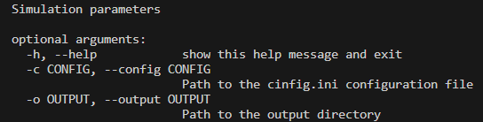

### Virtual Datasets Generator

*A bioinformatics tool for the creation of virtual metagenomics datasets*

### INTRODUCTION

The virtual dataset generator is a Python program used to generate a virtual metagenomics dataset with the goal of optimizing the viral detection module. It uses different simulation software such as ART and NanoSim. This software can be used to generate reads that can help identify bias in your pipeline and detect errors in your sequencing wet lab protocols.

### INPUT

The program will receive 2 input paths, one for a .ini file and one for the output directory.
This .ini file will contain all the information needed to run the desired simulation (ART or NanoSim).

### REQUIREMENTS

Modules
- Python 3.11.5
- Dataclasses == 0.6
- Pandas == 1.3.5
- Numpy == 1.19.2
- Xopen == 1.7.0

### MAIN OUTPUTS
- ART_r1.fq.gz 
- ART_r2.fq.gz
- NanoSim_r1.fq.gz
- NanoSim_r2.fq.gz

### API

### CONFIG PARAMETERS

The different software simulation parameters are passed through the system by the config.ini file. This config file has 4 types of parameters. The first parameter is the [SOFTWARE_REQUEST] parameter, in this parameter you insert the types of simulation software you want to run (ART and NanoSim being currently the only ones available). The second parameter is the [FIXED_ARGUMENTS] parameter, this parameter is used to pass all the parameters that are common among different software. The third parameter is the [ART_ARGUMENTS] parameter, here you pass the arguments specific to the ART software. The fourth parameter is the [NANOSIM_ARGUMENTS] parameter, in this parameter you pass all the NanoSim specific arguments which are not common among different software.

### SOFTWARE ARGUMENTS
- SOFTWARE_REQUEST_NANOSIM: Write "nanosim" if you want to run the NanoSim software simulation
- SOFTWARE_REQUEST_ART: Write "art" if you want to run the ART software simulation

### FIXED_ARGUMENTS
- output: Path to the output file
- csv_path: Path to the CSV file
- number_of_reads: Number of reads/read pairs to be generated per sequence

### ART_ARGUMENTS
- R1: The first-read quality profile
- R2: The second-read quality profile
- len_of_reads: The number to be simulated
- size_of_sample: The mean size of DNA/RNA fragments 
- sd : The standard deviation of the fragment size for pair end simulations 

### NANOSIM_ARGUMENTS
- model_prefix: Location and prefix of error profile model
- max_len : The maximum length for simulated reads
- min_len : The minimum length for simulated reads
- min_poly_len: Minimum homopolymer length to simulate homopolymer contraction and expansion events
- base_quality : Simulate homopolymers and/or base qualities with respect to chosen basecaller: albacore, guppy or guppy-flipflop
- strandness: Proportion of sense sequences. Overrides the value profiled in characterization stage. Should be between 0 and 1
- dna_type: Specify the DNA type: circular or linear
- num_threads : Number of threads for simulation
